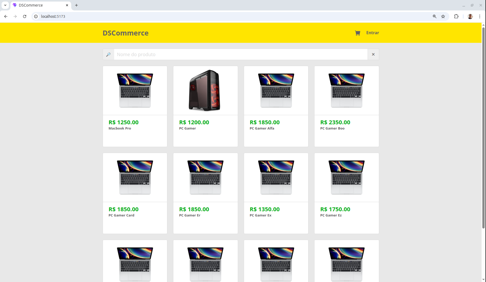
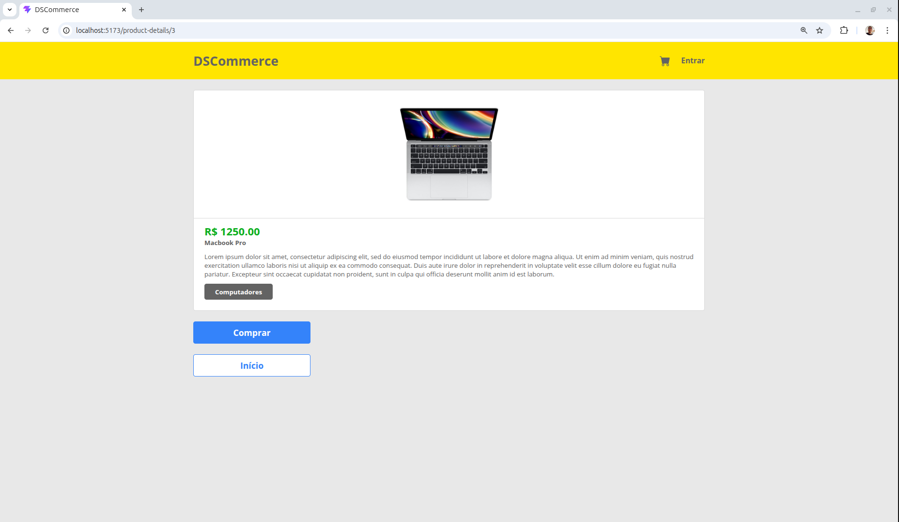
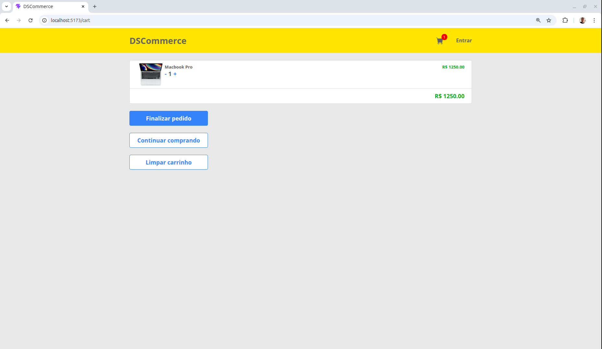
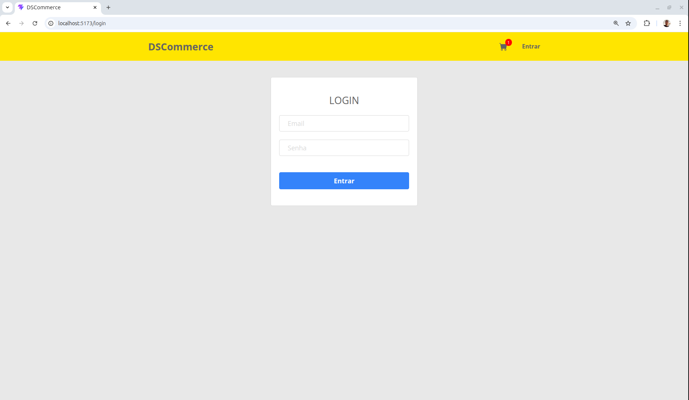
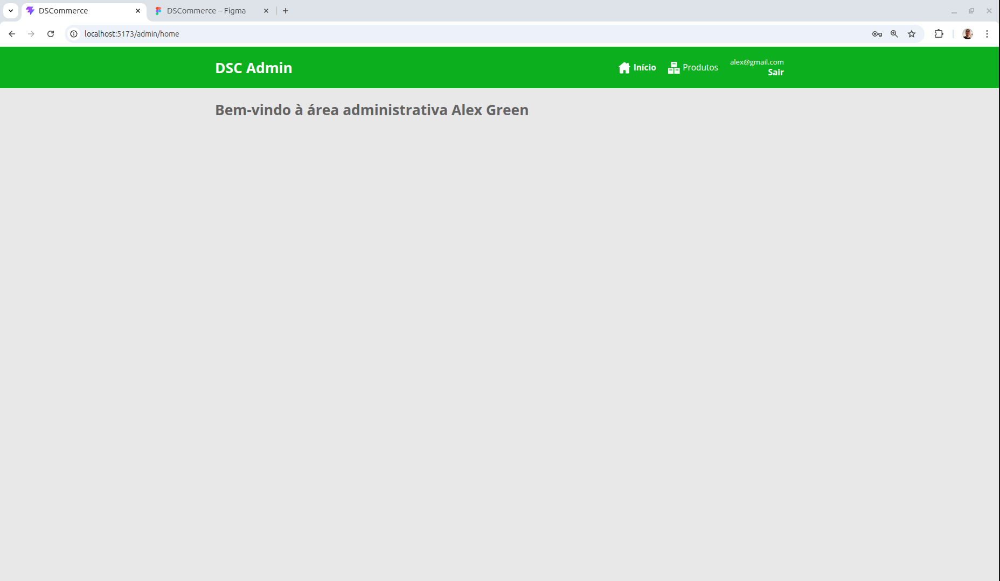
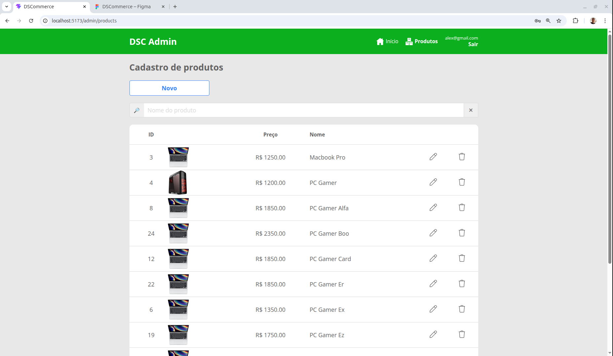
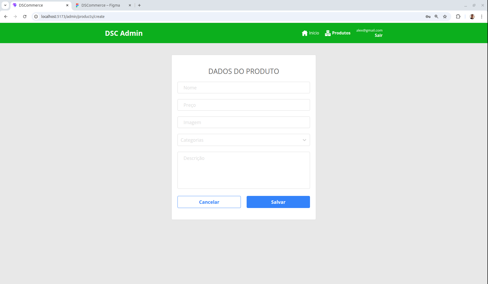
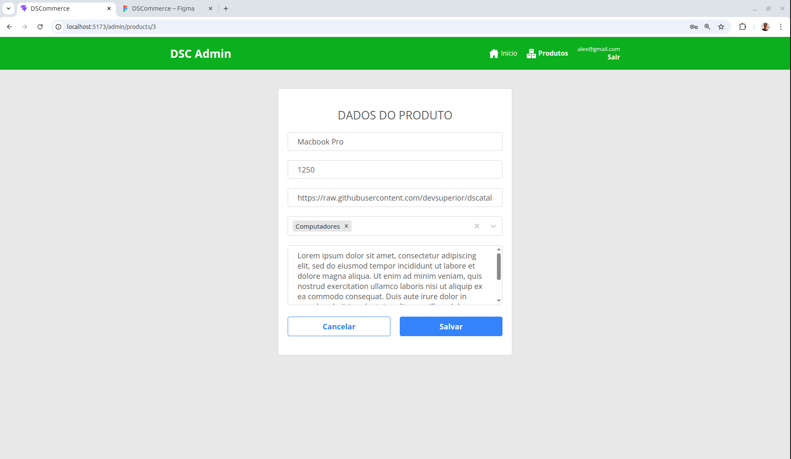
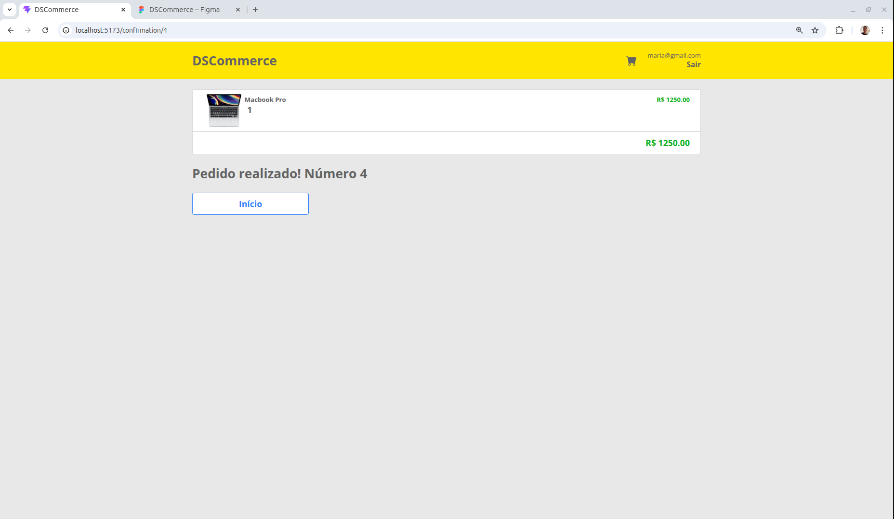

# DSCommerce Frontend
[](https://github.com/JuniorAC90/dscommerce-frontend/blob/main/LICENSE) 

# Sobre o projeto

DSCommerce é uma aplicação web de e-commerce desenvolvida com ReactJS, consumindo uma API REST em Spring Boot.

O sistema simula um fluxo completo de loja virtual, incluindo navegação de produtos, carrinho de compras e autenticação de usuários.

## 🎨 Layout

### Catálogo de produtos


### Detalhes do produto


### Carrinho de compras


### Login


### Área administrativa




### Cadastro de produto


### Edição de produto


### Confirmação de pedido


# Tecnologias utilizadas
- React 19
- TypeScript
- Vite
- Axios
- React Router DOM 6


# Como executar o projeto
Pré-requisitos: Node.js

```bash
# clonar repositório
git clone https://github.com/JuniorAC90/dscommerce-frontend.git

# entrar na pasta do projeto 
cd dscommerce-frontend

# instalar dependências 
yarn

# executar o projeto 
yarn dev
```

## ⚠️ Observação

Para funcionamento completo da aplicação, é necessário executar o [Backend](https://github.com/JuniorAC90/dscommerce-backend-aulas-cap04-3.4.3).


# Autor

Aloizio da Costa Junior

https://www.linkedin.com/in/JuniorAC90
